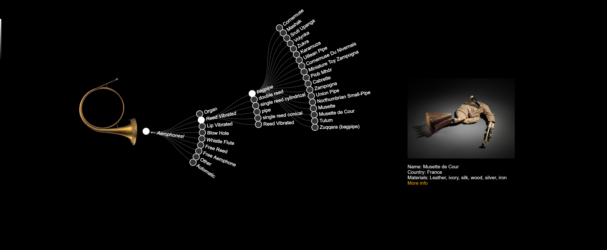
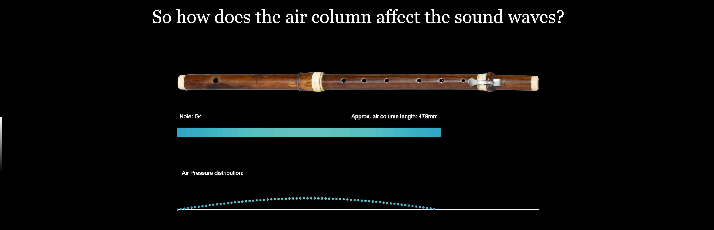
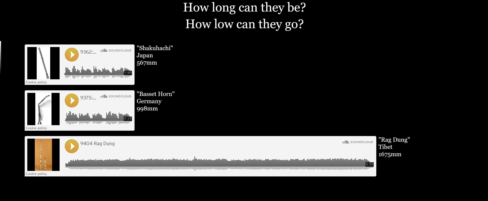

### Project 3: Interactive

-------------------------

### Introduction

This project investigates the Aerophone collection of the Metropolitan museum of Art (The MET).
An interactive website was constructed and can be found below and [here](www.antimurphy.com/dataviz).

==> [Live interactive website](http://www.antimurphy.com/dataviz/) <==

### Description

A variety of visualization techniques were used to create a scrollable slideshow-type website using Stack from Mike Bostock.

1. Hierarchical Aerophone Family Tree
-----------------------------------
* A collabsible D3.js radial hierarchy tree visualization was constructed using data from the MET open access CSV file; costumized to aid storytelling.

* Hierarchical data preprocessing was conducted with R to extract the hierarchical structure from the MET collection "object classification" field. 
Each level of the hierarchy was extracted from the MET text field using regular expressions and then stored in a new dataframe variable.
Only instruments with Open Access Images were used, which reduced the amount of objects from 2000+ for all aerophones to 700+ for open access items with images.

* The data was further aggregated by removing duplicates and musical instrument keys ("in D", "in C", in "F"), 
which reduced the dataset further to 261 instruments. This was deemed the lowest level of aggregation possible, while still being a manageable number to visualize.

* On the lowest tree level the MET collection object image is shown, including some additional details and a link to the original MET website.

2. Air column investigation
-------------------------
* A P5.js interactive animation was also implemented to illustrate how air pressure waves change frequency with air column length.
Air pressure fluctuations was simulated using the half-length standing waveform to allow interactive exploration of the different notes
played on a Baroque flute. Normalized air pressure and frequency was mapped to colour and position to plot both a longitudinal and transversal
illustration of the air column pressure for maximum illustrative effect.

* An embedded sound cloud recording was turned into a basic bar chart that plays sound to audibly hear the frequency of instruments as a function of their length.

