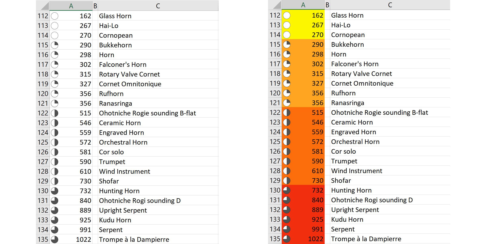

### Project 4: New Contexts

### Aerophone Family Tree Sculpture

--------------------------

### Introduction

A physical model sculpture (static) was constructed using the Metropolitan Museum of Art (The MET) aerophone (wind instrument) dataset.
The sculpture consists of a metal wire tree to represent the hierarchical relationship of all aerophones (wind instruments) at the MET.
Object sizes were then also mapped to a coloured label and attached to the tree.

### Pre-process and project direction
---------------------------------------------

MET data for musical wind instruments (aerophones) was aggregated in the previous interactivity project and  
items with duplicates and keys ("in D", "in C" in "F" etc.) was removed. Only MET open access items were included, 
which reduced the dataset from 2000+ individual objects to 261 lowest level category items. This previous project is documented in the 
[previous interactive assignment github folder](https://github.com/acdreyer/PGDV5200_MajorStudio1/tree/master/Project_Interactive)
and is hosted on a [live website](http://www.antimurphy.com/dataviz/).
A screenshot of the hierarchical visualization with one branch activated is shown below:

For the current assignment of using new contexts, it was attempted to represent the whole aerophone dataset in a pysical artistic piece.
Digital methods were investigated at first; possibly to 3D print a model, however with many datapoints it wasn't clear how to meaningfully
and structurally sound to represent the data. Basic size and shape experiments were conduced using Rhino and Grasshopper in order to 
gauge if a 3D tree with the corresponding branches could work. 

### Metal wire hierarchy tree
------------------------------------------

A 3D-printed CAD sculpture was not deemed ideal and hence a metal wire tree was chosen.
A basic size of approx. 200mm was viewed as optimal for the expected size/width ratio, 
even though it would imply a slightly longer starting size of the wire bundle.
Wire bundle mockups were made and wire bundle sizes were calculated based on equivalent bundling areas. 
According to beading blogs a 20-22gauge would be the best sizes to use considering ease of handling, 
hence it was decided to use 20 gauge (0.8mm; 0.030" wire).
Copper wire would have been ideal, but due to availability, delivery lead times and cost it was decided 
to use mild steel MIG welding wire from Home Depot. This was a compromize that made handling more difficult, but ultimately resulted in 
a much more sturdy tree. The wire also proved to be very resilient to multiple bending fatigue. 

Bundling order and size was determined by building a metal jig and setting up a hierarchy tree in D3 using the previous dataset.
The [process tree code](http://htmlpreview.github.io/?https://github.com/acdreyer/PGDV5200_MajorStudio1/blob/master/Project_NewContexts/ProcessTree/index.html) 
was setup using the previously aggregated data using a [code block for a linear tree layout](http://bl.ocks.org/tchaymore/1249394)
and is given in the [github folder](https://github.com/acdreyer/PGDV5200_MajorStudio1/blob/master/Project_NewContexts/ProcessTree/index.html)

A screenshot is shon below. A .pdf version was used to highlight which bundles were already formed.

Wires were wrapped around the jig and counted according to the hierarchy levels using cableties.

The wire stiffness  implied only small bundles or single wires could be shaped at a time and the stem was 
subsequently shaped with individual wires.

The following shows the completed main stem.

Wires proved difficult to bend in groups, hence the tree was held in a vise at the University Making Centre workshop.
A bolt was used to hook into the wire loops to twist the wires bundles.

The wire tree was then mounted to a pre-constructed base from Blick Art store.

The completed tree represents the hierarhical data structure of all types of aerophones at the MET.

### Adding Object data: the "Leaves"
--------------------------------------------

Even though a "tree" without "leaves" tells a story on its own considering wire bundle sizes and shapes,
it was felt that an additional layer of data would be beneficial.
Images weren't deemed feasible due to size and varying aspect ratio, but instrument size would be a welcome parameter
that wasn't previously explored.

The aerophone dimension dataset is not something that would be easy to parse automatically due to varying units (inch, cm, mm),
types and ordering.

Subsequently data for the 261 objects was parsed manually in MS Excel by extracting only the maximum size parameter; "length",
even though it is acknowledged that this isn't necessarily the sounding length of the instrument, it would constitute some indication
of the overall size of each object. 

Using conditional formatting in MS Excel a redundant cell colour and icon was used to map object length to the retinal variables of colour and shape.

Upper length categories were grouped in order to avoid outliers getting lost in the visual impact,
create more aesthetic spread across the tree and also to limit the amount of colour categories because of paper limitations (see below).

Typeface samples were made up and finalized, but additional thought was given to colour coding.

It was decided to use coloured paper for quality purposes, since the "leaves" would undergo some level of handling during the construction/sculpting
process. This also limited the amount of colour categories by availibilty of coloured paper. 
Laser printer ink was also found to de-attach from the paper with rough handling, hence all relevant categories were painted with Vallejo 
Satin Varnish, which greatly increased the durability of the ink and also added nice sheen to each "leaf".
Using colored paper meant printing all data on all colours, but then using only the categories that are relevantly coded according to the 
length icons. This redundant use of icons greatly increased effeciency during the construction phase.

Labels were folded double, glued together with "Blick white glue stick" and attached to each "wire twig" in its corresponding category
using superglue. 

The labels were shaped and twisted to give the aesthetic of the wind blowing over them; which was deemed an appropriate
visual language for wind blowing over wind instruments...

### Process

### Result
