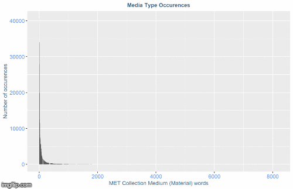
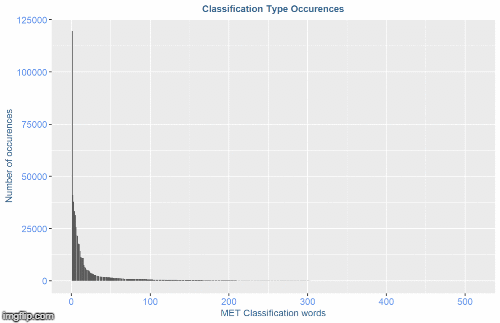
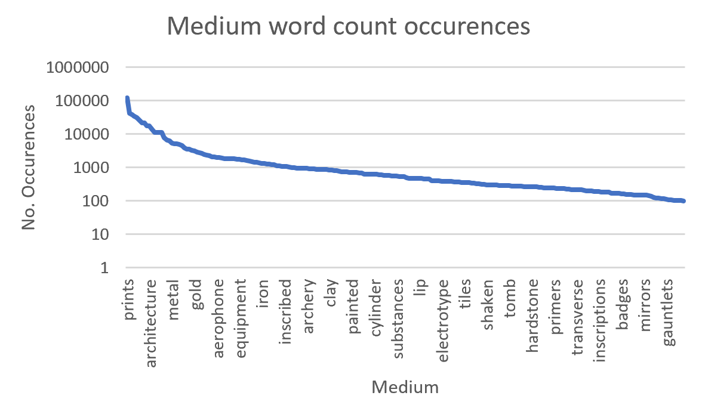
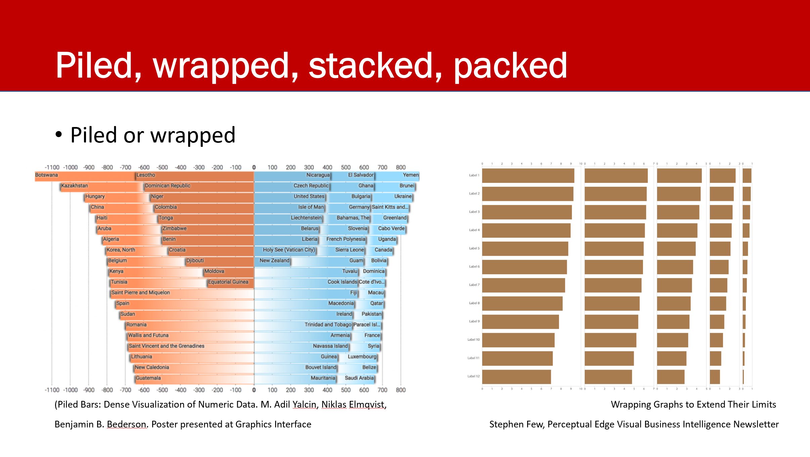
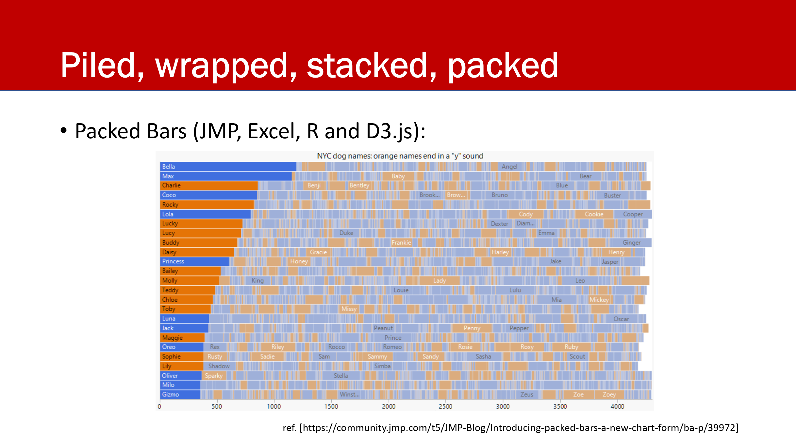
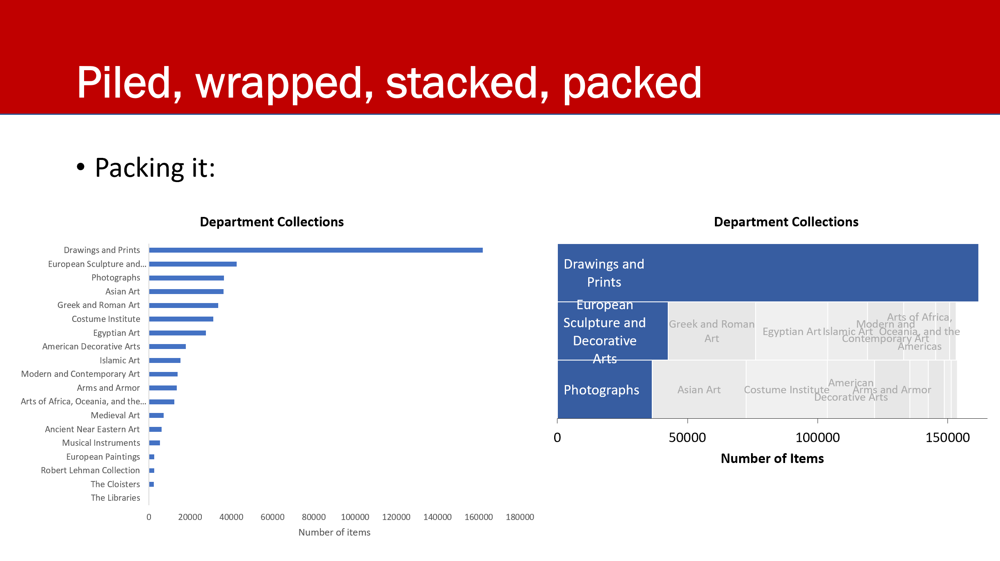
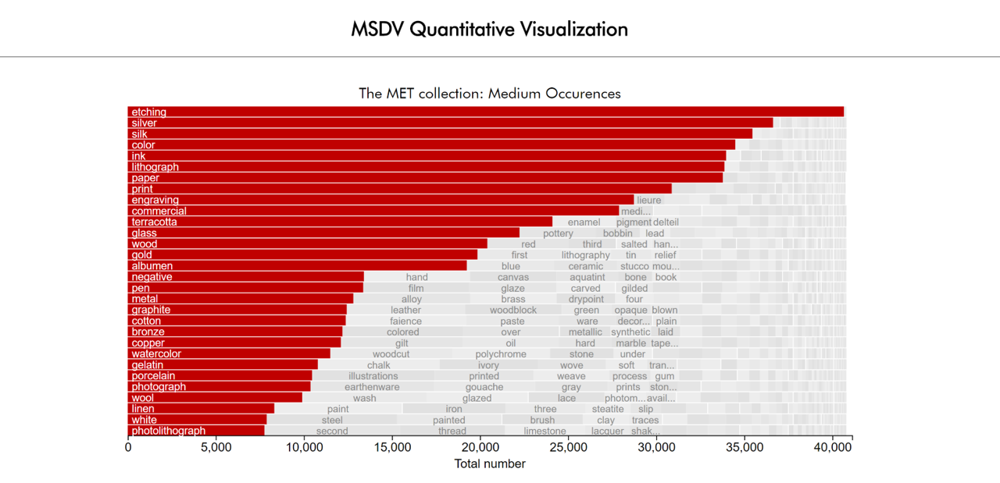

## Quantitative Visualization

This folder contains project updates for the Quantitative Visualization
project wherein data from the Metropolitan Museum of Art (the MET) is visualized using a [Packed Bar Chart](https://community.jmp.com/t5/JMP-Blog/Introducing-packed-bars-a-new-chart-form/ba-p/39972).


If you want to skip all the details and just see the final product, go [here](http://htmlpreview.github.io/?https://github.com/acdreyer/PGDV5200_MajorStudio1/blob/master/Project_Quantitative/index.html).

### Introduction

With such a big dataset such as the one from the [MET Open Access](https://www.metmuseum.org/about- the- met/policies- and- documents/open- access)
initiative (in excess of 400,000 items), constructing a visualization of the entire collection is deemed a challenge
in a short space of time. However, with such a rich dataset it seems beneficial to visualize parameters that span across the entire collection.

Subsequently it was decided to focus on the MET Open Access [CSV](https://github.com/metmuseum/openaccess)
for conceptual study rather than the [MET API](https://metmuseum.github.io/).
The large CSV (presently 231MB) has its own challenges in handling and processing.
Subsequently it was decided to use R to process the file for initial inspection and easier handling.
At the time of writing the CSV file contained 469,069 entries, 44 total columns. 


### The Dataset

Prior to accessing the full dataset, the first visualization concept entailed
a view of materials used by cultures and empires accross history. The idea was
that major materials such as wood, stone, bronze, iron and steel would be 
plotted against the empires in the collection (e.g. the Greeks, Romans etc.)
However, after greater detailed investigation into the dataset it became apparent
that a simple cultural categorization is most likely an approach that is too simplistic.

The the level of detail that cultures and materials are documented would imply
that selecting only a few materials and cultures would lose a great opportunity
in interacting with the rich dataset. Furthermore, the amount of media identified
is staggering. Categorizing it into only basic materials won't do it justice.

To give an example, a brief list of materials that were encountered include:

- Earthenware
- Porcelain
- Ivory
- Pewter
- Leather
- Silk
- Cotton
- Glass
- Bamboo
- Bone
- ...

Not only is the list of material types extensive, the cultures are also extremely
diverse. It was subsequently deemed necessary to do some text mining and investigate
just how many different materials there are.

Hence, the Text Mining library in R was employed to explore the dataset. 
The R script input file is given as [MET_DataWrangling_TextMining.R](https://github.com/acdreyer/PGDV5200_MajorStudio1/tree/master/Project/MET_DataWrangling_TextMining.R)

The most notable depencies are
```
# library("tm") #for text mining
# library("SnowballC") #for text stemming
# library("ggplot2")
```
The large dataset was reduced by only extracting selected columns related to the collection materials.
Relevant columns included the "Medium" and "Classification". 
The Classification field is much more elaborate than the Medium field since it contains
various additional information such as the type of object and manufacturing method.
Subsequently the Classification was also included in the mining, albeit handled separately.

The majority of the text mining stopwords were identified with:

```
     stopwords= c("on", "and","(a)","(b)","(c)","(d)","(e)","(f)"
     ,"(g)","(h)","(i)","(j)","(k)","(l)","(m)","(n)"
     ,"(o)","(p)","(q)","(r)","(q)","(r)","(s)","(t)","(u)","(v)"
     ,"(w)","(x)","(y)","(z)","|"," "
     ," a)"," b)"," c)"," d)"," e)"," f)"
     ," g)"," h)"," i)"," j)"," k)"," l)"," m)"," n)"
     ," o)"," p)"," q)"," r)"," q)"," r)"," s)"," t)"," u)"," v)"
     ," w)"," x)"," y)"," z)"
     ,"with","of","state","black","brown","cut","blow"
     ,"hole","sets","single","main","or","in","for","ã"
     ,"etc","not assigned","from","two","a","no","the","off","an","as"
     ,"by","de","cm","sec","un","100","wth","upon","ia","et","e–g"),
     wordLengths = c(3, Inf))
```
After which the word frequency was counted using `termFreq(mediumRawText, ctrl)`.

The output was a dataset with number of word occurences which is ideal to plot
in a histogram. While filtering through the word frequencies it became apparent
that there are some words that are not applicable to the material, 
since it includes words such as "trimmings" and "export". Most of these words
can be filtered due to their low occurence, however some lesser known words
make the descriptions very interesting; such as "aerophone" and "steatite".
Some of these materials are interesting indeed and it would feel like a shame
to filter them just based on their low occurence.
Subsequently it was decided to devise a strategy to attempt plotting the whole
collection of occurences of Medium and/or Classification.
Using this method, it might be possible to include the tail end of the Histogram
and present the really interesting items for exploration.

The images below show the challenge of the word count distribution:




Various strategies were considered to solve the challenge of this plottting.

These include Logarithmic plot, with the deficiency of losing the comparative 
value between item occurences:




Or, [Circular bar charts](https://www.r-graph-gallery.com/circular-barplot.html)
even though these have their own [challenges](https://www.data-to-viz.com/caveat/circular_bar_yaxis.html):

Or the one that presently looks most favorable:
a [rotated Bar chart](https://www.data-to-viz.com/caveat/hard_label.html)
which could also be implemented as a [Lollipop chart](https://www.data-to-viz.com/graph/lollipop.html).

Subsequently a packet bar chart was chosen. Various types are possible. 




Finally a [packed bar](https://community.jmp.com/t5/JMP-Blog/Introducing-packed-bars-a-new-chart-form/ba-p/39972) chart was chosen.




This was subsequently implemented using the MET data set.


This shows the efficiency of screen space usage of the packed bar chart vs. a normal chart on its side.


An online live (static) version of the final implimentation can be found [here](http://htmlpreview.github.io/?https://github.com/acdreyer/PGDV5200_MajorStudio1/blob/master/Project_Quantitative/index.html).

[](http://htmlpreview.github.io/?https://github.com/acdreyer/PGDV5200_MajorStudio1/blob/master/Project_Quantitative/index.html)


