# Parsons The New School: Major Studio 1 (Fall 2019)

This repo is for Major Studio 1; for a Masters in Data Visualization course at The New school.
The data set was the Metropolitan Museum of Art (The MET) open access collection.

## Project 1: Quantifying the MET collection
--------------------------------------------

This project explores what the entire MET collection consists of and how much of it is there.

This project explores the entire collection and ways to show quantities and
distributions of various parameters using R and D3. Various ways were explored
to present all the data compactly on one screen. A packed bar chart was finally
used to optimize screen space and allow further exploration.
The [Github repo and process documentation](https://github.com/acdreyer/PGDV5200_MajorStudio1/tree/master/Project_Quantitative) for this project
is located [here](https://github.com/acdreyer/PGDV5200_MajorStudio1/tree/master/Project_Quantitative).

The project [webpage](http://htmlpreview.github.io/?https://github.com/acdreyer/PGDV5200_MajorStudio1/blob/master/Project_Quantitative/index.html)
can be found [here](http://htmlpreview.github.io/?https://github.com/acdreyer/PGDV5200_MajorStudio1/blob/master/Project_Quantitative/index.html).

[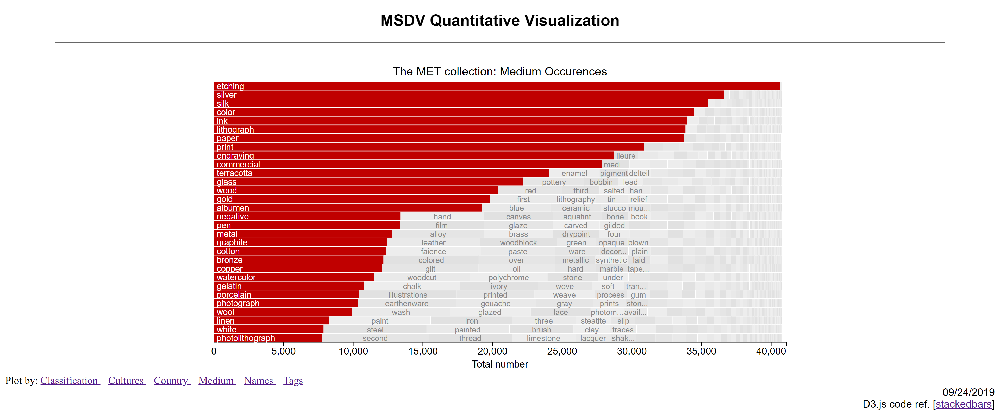](http://htmlpreview.github.io/?https://github.com/acdreyer/PGDV5200_MajorStudio1/blob/master/Project_Quantitative/index.html)
[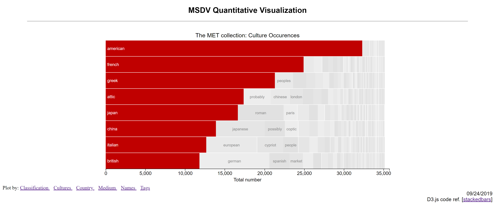](http://htmlpreview.github.io/?https://github.com/acdreyer/PGDV5200_MajorStudio1/blob/master/Project_Quantitative/index.html)
[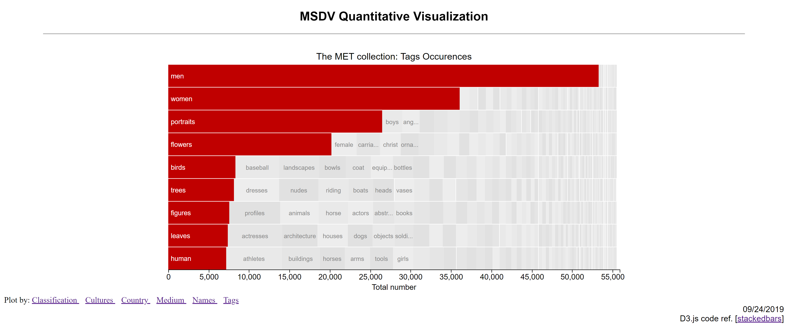](http://htmlpreview.github.io/?https://github.com/acdreyer/PGDV5200_MajorStudio1/blob/master/Project_Quantitative/index.html)

## Project 2: Evolution of Arms and Armor
--------------------------------------------

This project explores how medieval foot soldier arms and armor evolved throughout the centuries.

This project focuses on foot soldier helmets and weapons at the MET and groups
these objects through time and categories in order to compare which objects
existed during the same time period. The original [evolution of arms and armor
from Dean Bashford](https://htmlpreview.github.io/?https://raw.githubusercontent.com/acdreyer/PGDV5200_MajorStudio1/master/Project_Qualitative/DeanBashFord.html)
 was used as inspiration and implemented in a [narrative chart](https://source.opennews.org/articles/automating-xkcd-style-narrative-charts/) originally inspired by XKCD comics.
 Please refer to the [Github repo and process documentation](https://github.com/acdreyer/PGDV5200_MajorStudio1/tree/master/Project_Qualitative)
 for the full details.

The project [website](https://htmlpreview.github.io/?https://github.com/acdreyer/PGDV5200_MajorStudio1/blob/master/Project_Qualitative/index.html) is located
[here](https://htmlpreview.github.io/?https://github.com/acdreyer/PGDV5200_MajorStudio1/blob/master/Project_Qualitative/index.html).

[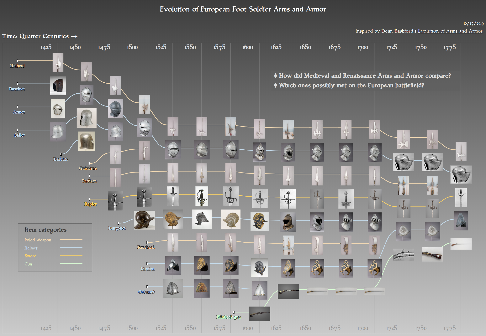](https://htmlpreview.github.io/?https://github.com/acdreyer/PGDV5200_MajorStudio1/blob/master/Project_Qualitative/index.html)
[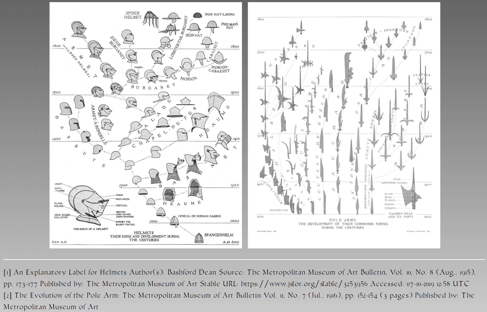](https://htmlpreview.github.io/?https://raw.githubusercontent.com/acdreyer/PGDV5200_MajorStudio1/master/Project_Qualitative/DeanBashFord.html)

## Project 3: Aerophones (wind instruments)
--------------------------------------------

This project explores the Aerophone (wind instrument) family tree; what different types and subtypes
are at the MET.

An interactive segmented radial hierarchy tree was constructed using Aerophone classification
parameters. These were then grouped into a hierarchical structure that allows the user to 
explore this hierarchy while showing examples of the collection corresponding to these instrument types.
An interactive exploration of air column length was also implemented in P5.js to illustrate how 
instrument air column length affects instrument frequency.

The link to the [Github repo and process documentation is here](https://github.com/acdreyer/PGDV5200_MajorStudio1/tree/master/Project_Interactive).

The [project](http://www.antimurphy.com/dataviz/) website is located [here](http://www.antimurphy.com/dataviz/).

[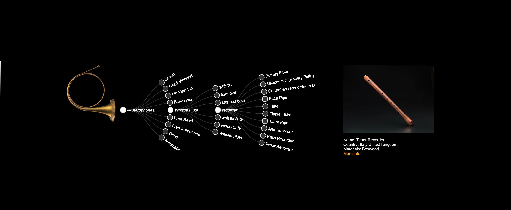](http://www.antimurphy.com/dataviz/)

[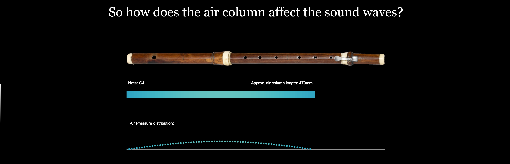](http://www.antimurphy.com/dataviz/)

## Project 4: Aerophone family tree sculpture
--------------------------------------------

This project explored the Aerophone (wind instrument) hierarchy at the MET through construction of
a physical 3D wire tree sculpture.

The previously generated data set was converted to a linear hierarchical tree to facilitate wire tree
construction. Wires were grouped and shaped according to the data structure categories and these
were mounted to a wooden base. Labels were added for each individual type of item and colour coded
according to object length (size).

Herewith is the link to the [Github repo and process documentation](https://github.com/acdreyer/PGDV5200_MajorStudio1/tree/master/Project_NewContexts).

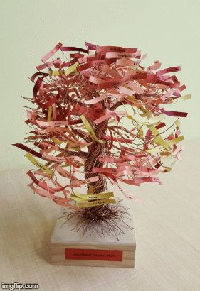

Wire Tree            |  Views
:-------------------------:|:-------------------------:
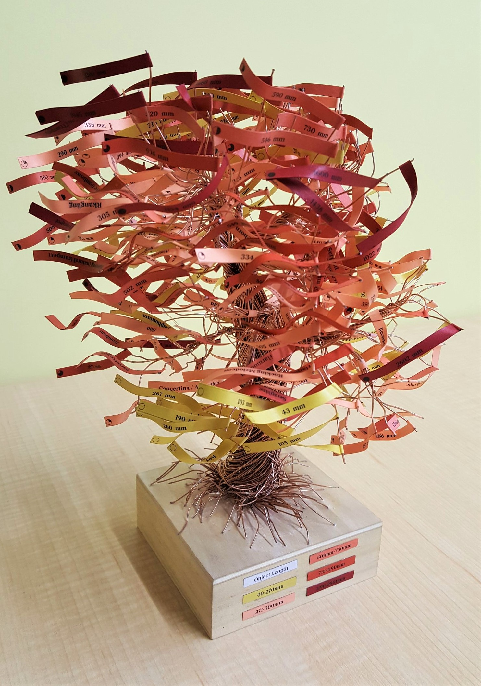|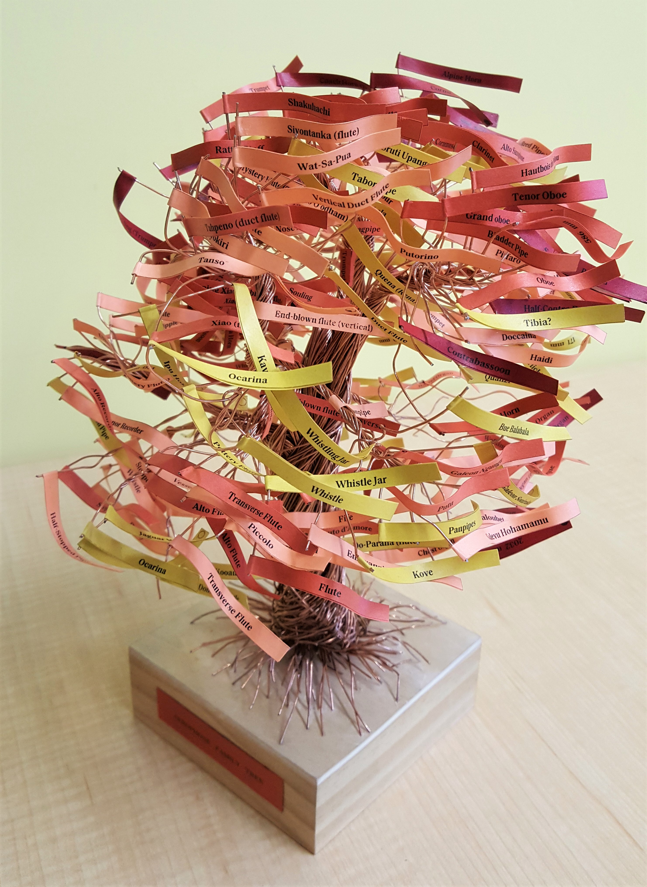
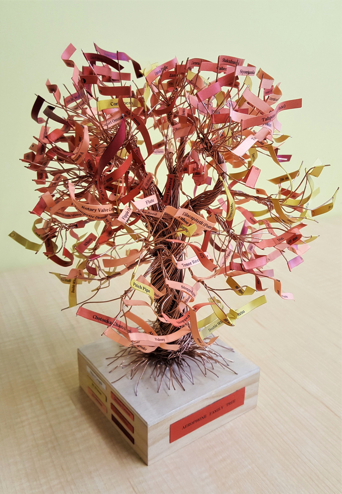|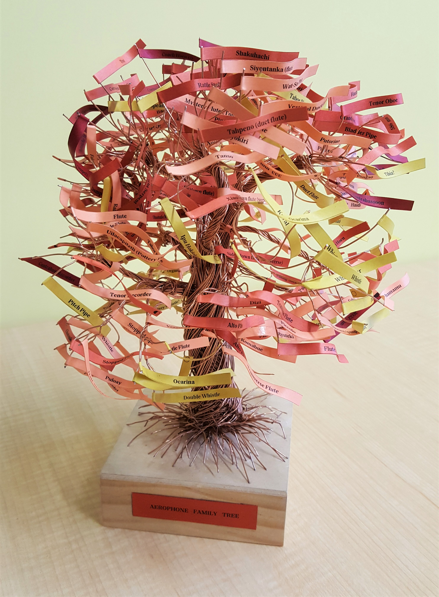

------------------------------
The University course github page is located [here](https://github.com/anbnyc/major-studio-1-fa19).